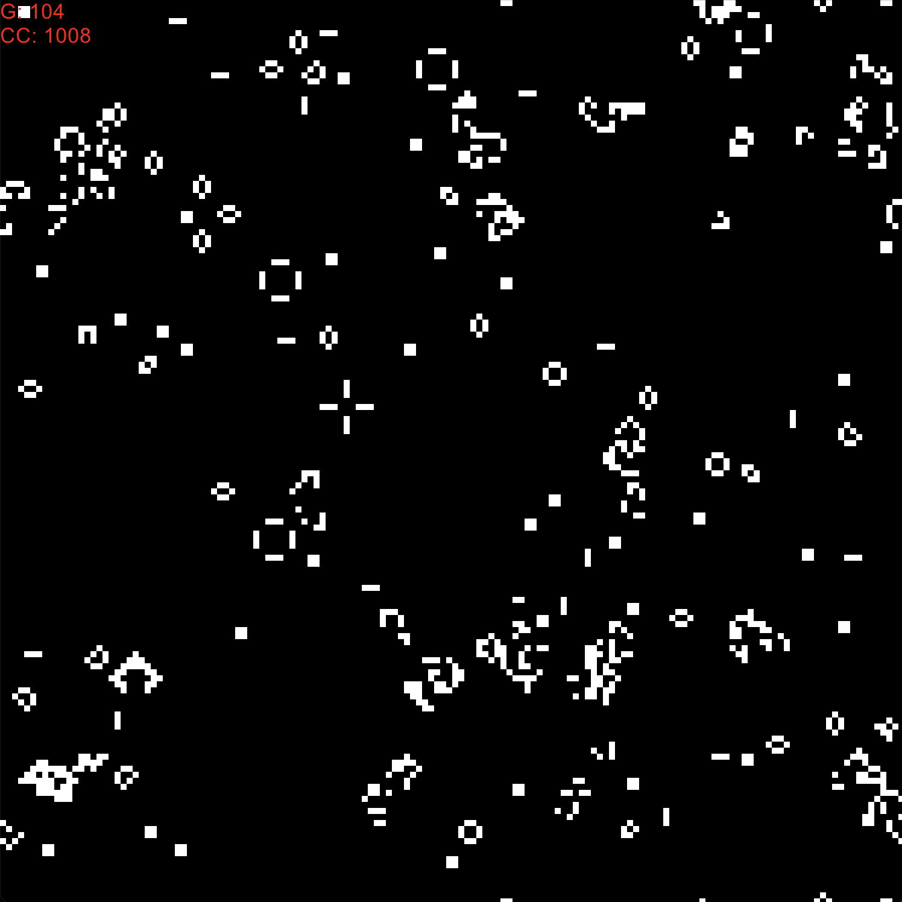
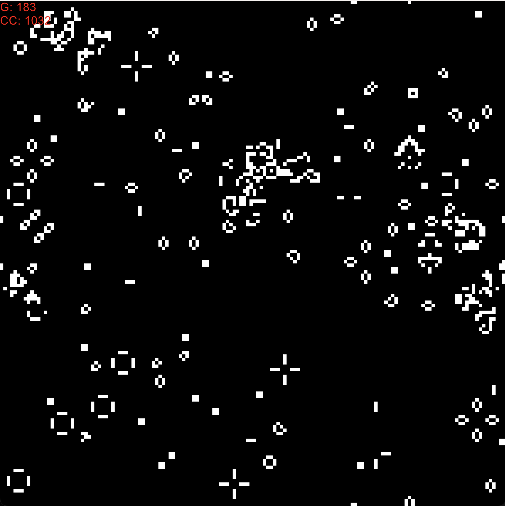

# **ca_conway**  

**Eine Ruby-Implementierung von Conways "Spiel des Lebens" (Game of Life)**  

### **Inhaltsverzeichnis**

  * [Projektübersicht](#projektübersicht)
  * [Funktionsweise](#funktionsweise)
  * [Aktuelle Features](#aktuelle-features)
  * [Screenshots](#screenshots)
  * [Installation & Nutzung](#installation--nutzung)
  * [Steuerung während der Simulation](#steuerung-während-der-simulation)
  * [Referenzen](#referenzen)

-----

### **Projektübersicht** <a id="projektübersicht"></a>

**ca_conway** ist eine dynamische Ruby-Implementierung von John Horton Conways berühmtem "Spiel des Lebens". Dieses faszinierende **zelluläre Automaten-System** simuliert die Entstehung komplexer evolutionärer Muster auf einem 2D-Gitter, basierend auf einfachen Nachbarschaftsregeln. Beobachten Sie, wie Leben entsteht, gedeiht und vergeht!

-----

### **Funktionsweise** <a id="funktionsweise"></a>
Das Programm modelliert ein 2D-Gitter von Zellen, die lebendig (`weiß`) oder tot (`schwarz`) sein können. Jede Generation berechnet sich nach Conways klassischen Regeln:

1.  **Überleben:** Eine lebende Zelle mit 2 oder 3 lebenden Nachbarn bleibt am Leben.
2.  **Sterben:** Eine lebende Zelle mit weniger als 2 (Unterbevölkerung) oder mehr als 3 (Überbevölkerung) lebenden Nachbarn stirbt.
3.  **Geburt:** Eine tote Zelle mit genau 3 lebenden Nachbarn wird lebendig.

-----

### **Aktuelle Features** <a id="aktuelle-features"></a>

* **Grafische Benutzeroberfläche (GUI) mit Gosu:** Visualisiert das Gitter in Echtzeit.
* **Toroidale Topologie (Wrap-around-Ränder):** Das Spielfeld ist wie ein Donut geformt – Zellen, die den oberen Rand verlassen, erscheinen unten wieder, und dasselbe gilt für links/rechts. Dies ermöglicht unendliche Bewegungen von Mustern wie Gleitern.
* **Anpassbare Simulation Geschwindigkeit:** Steuern Sie, wie schnell sich die Generationen entwickeln.
* **Echtzeit-Anzeige:** Zeigt die aktuelle **Generationsnummer** und die **Anzahl der lebenden Zellen** in der oberen linken Ecke an.
* **Interaktive Steuerung:** Klicken Sie mit der Maus auf Zellen, um deren Zustand (lebendig/tot) direkt zu ändern.
* **Anpassbare Grid-Größen** und Startmuster (z. B. zufällige Besiedlung).

-----

### **Screenshots** <a id="screenshots"></a>
  


-----

### **Installation & Nutzung** <a id="installation--nutzung"></a>

Um dieses Projekt auszuführen, benötigen Sie **Ruby** und die **Gosu-Bibliothek**.

1.  **Klonen Sie das Repository:**

    ```bash
    git clone https://github.com/dein-username/ca_conway.git  
    cd ca_conway
    ```

2.  **Installieren Sie Gosu:** Wenn Gosu noch nicht installiert ist, müssen Sie es über RubyGems installieren.

    ```bash
    gem install gosu
    ```

3.  **Starten Sie die Simulation:**

    ```bash
    ./run.sh start 
    ```

    *(Hinweis: Stellen Sie sicher, dass 'game\_of\_life.rb', 'Cell.rb' und 'World.rb' im selben Verzeichnis liegen und `run.sh` ausführbar ist (ggf. `chmod +x run.sh` ausführen).)*

-----

### **Steuerung während der Simulation** <a id="steuerung-während-der-simulation"></a>

* **Mausklick:** Klicken Sie auf eine Zelle, um ihren Zustand (`lebendig` / `tot`) umzuschalten.
* **ESC-Taste:** Beendet die Anwendung.

-----

### **Referenzen** <a id="referenzen"></a>

  * [Conways Spiel des Lebens (Wikipedia)](https://de.wikipedia.org/wiki/Conways_Spiel_des_Lebens)
  * [Ruby-Programmiersprache](https://www.ruby-lang.org/)
  * [Gosu (2D Game Development Library)](https://www.libgosu.org/)